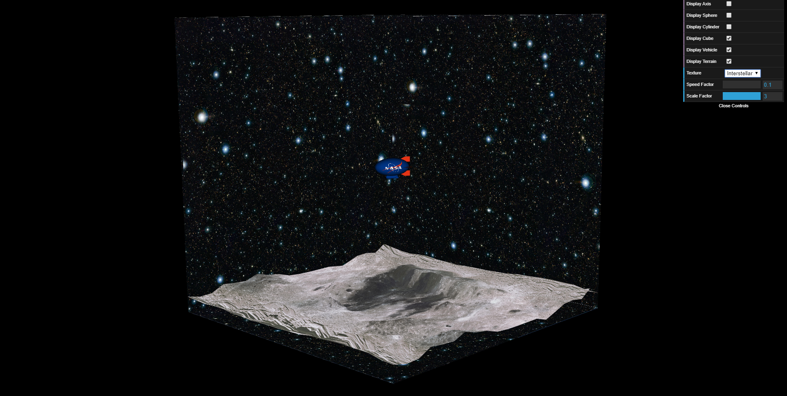
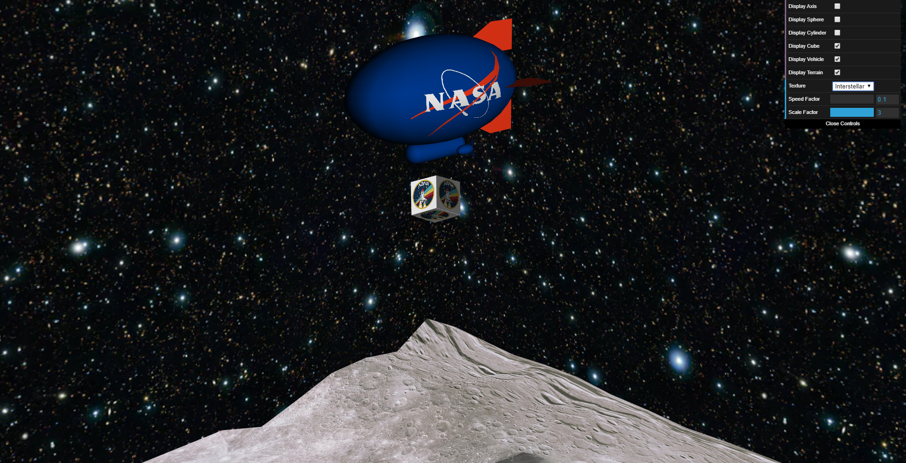
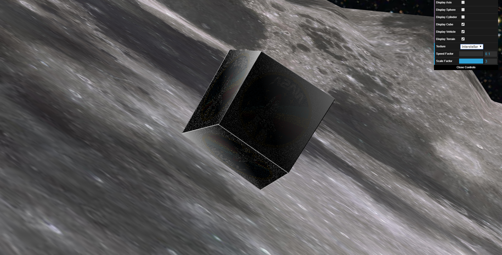
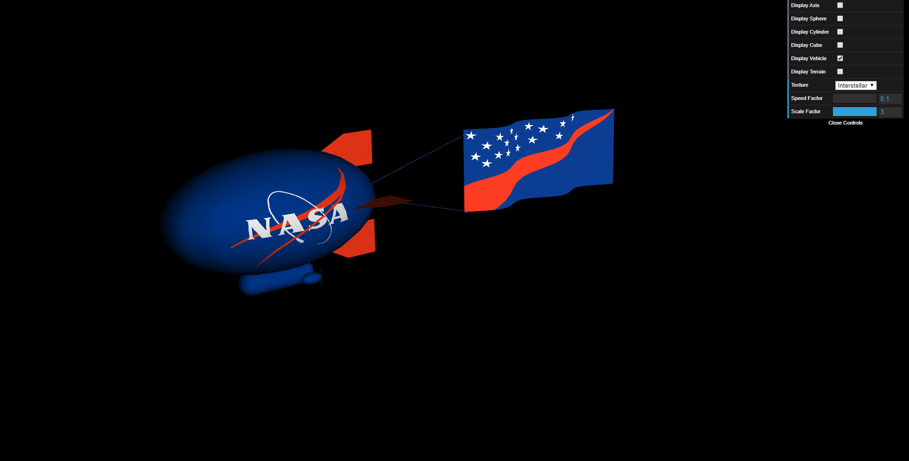

# Coisas por corrigir

- Linha branca entre as faces do cubo unitário
- *Delay* entre pressionar uma tecla e o movimento correspondente
- Posição final do piloto automático
- Colocar ondulação da flag para trás nos dois lados
- Colocar flag a rodar conforme o dirigivel

# Screenshots

## 1

## 2

## 3

## 4

## 5

## 6

