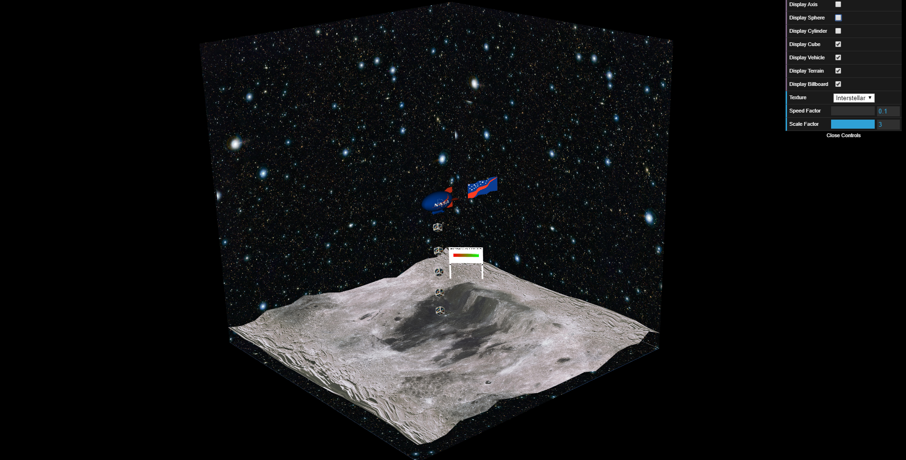
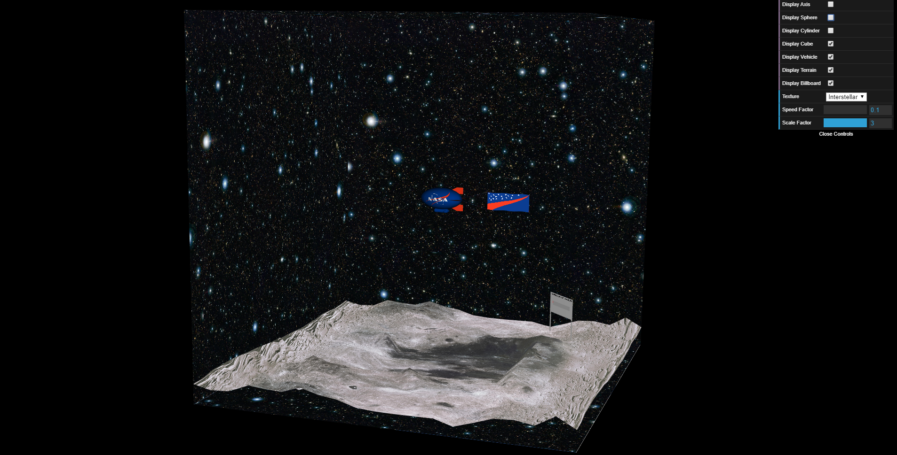
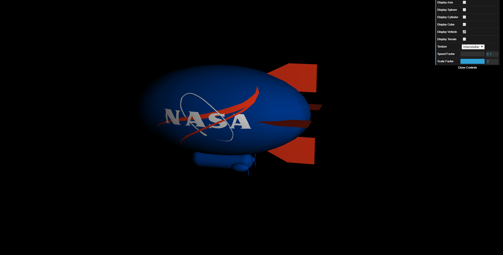
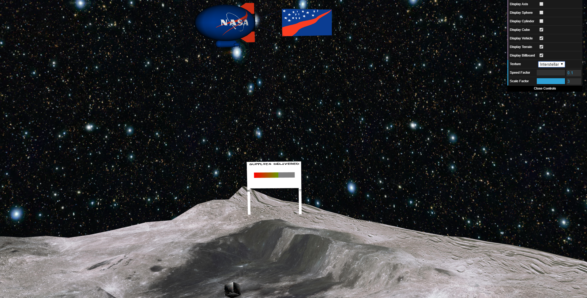

# CGRA Final Project

Project made during the **2nd semester** of the **2nd year** of **Integrated Master in Informatics and Computing Engineering**, in **Computer Graphics** curricular unity (FEUP).

[CGRA FEUP-Sigarra](https://sigarra.up.pt/feup/en/UCURR_GERAL.FICHA_UC_VIEW?pv_ocorrencia_id=368702 "Curricular Unity Homepage")

Made by:

- João Carlos Machado Rocha Pires (up201806079) - [GitHub Profile](https://github.com/JoaoCarlosPires "GitHub Profile")
- Luís Filipe Sousa Teixeira Recharte (up201806743) - [GitHub Profile](https://github.com/filipeeteixeira "GitHub Profile")

## Demonstration Video

[Demonstration Video](https://www.youtube.com/watch?v=3hM5_BhhGgQ "YouTube Link")

## Geral

## *Screenshots*

### Airship (proj-t5g05-1.png)

### Cube Map + Terrain + Airship (proj-t5g05-2.png)

### Airship + Supply falling (proj-t5g05-3.png)

### Supply on floor (proj-t5g05-4.png)

### Airship + Flag (proj-t5g05-5.png)

### Airship + Flag + Supply on floor + Terrain + Cube Map + Billboard (proj-t5g05-6.png)

